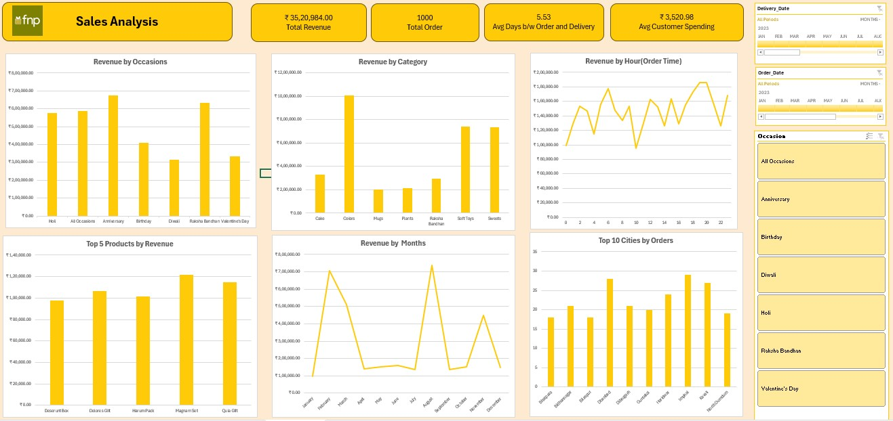

# 📊 FNP Sales Analysis Dashboard

This repository contains an **interactive Sales Analysis Dashboard** built to visualize and analyze key business metrics for FNP.  
It provides actionable insights into revenue, customer behavior, and order trends.

---

## 🚀 Features

✅ **Key Metrics at a Glance**
- ₹35,20,984 Total Revenue
- 1000 Total Orders
- 5.53 Days Avg. Order-to-Delivery
- ₹3,520.98 Avg. Customer Spending

✅ **Revenue Analysis**
- **By Occasions:** Holi, Anniversary, Birthday, Diwali, Raksha Bandhan, Valentine’s Day
- **By Category:** Cakes, Colors, Mugs, Plants, Soft Toys, Sweats
- **Top Products:** Dessert Box, Deluxe Gift, Harum Pack, Magnum St, Quiz Gift

✅ **Time-Based Insights**
- Revenue trends **by Months**
- Revenue patterns **by Hour of Order Time**

✅ **Geographical Insights**
- Top 10 Cities by Orders

✅ **Interactive Filters**
- Filter by **Delivery Date** or **Order Date**
- Filter by **Occasion**

---

## 📷 Dashboard Preview

---

## 📈 Key Insights

- **Anniversary** and **Raksha Bandhan** are top revenue-generating occasions.
- **Cakes** and **Soft Toys** lead in revenue among product categories.
- Peak revenue months include **February, August, and October**.

